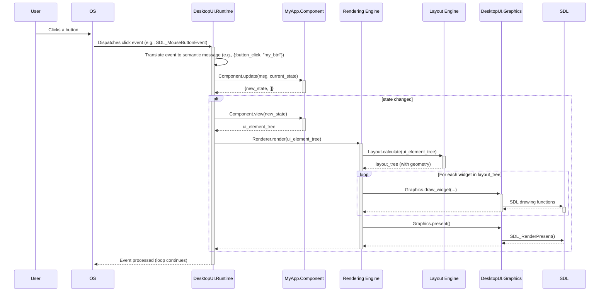
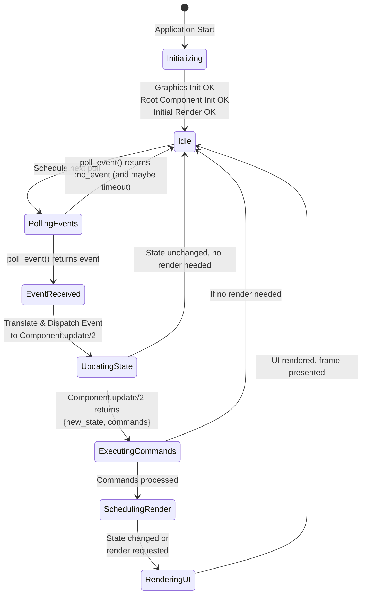

Of course. Based on the research and the user's request, I will now craft an architectural design for the proposed Elixir desktop UI framework. This design will detail the various components, their responsibilities, and their interactions, using Mermaid diagrams to illustrate the system architecture and data flow. I will focus on the 2D aspects as requested.

Here's a plan for the architectural design:

1.  **High-Level Overview:** A Mermaid diagram showing the main layers of the framework and their interaction with the Elixir Application, the BEAM, and the underlying Operating System/Graphics.
2.  **Core Components (Elixir Land):**
    *   **`DesktopUI.Elm` Behaviour:** Defines the contract for components (`init/1`, `update/2`, `view/1`).
    *   **`DesktopUI.Runtime` (GenServer):** The heart of the application, managing the main loop, state, and communication.
    *   **Component Modules:** User-defined modules implementing the `DesktopUI.Elm` behaviour.
    *   **UI Description (Virtual DOM/Tree):** The declarative structure returned by `view/1`.
    *   **Widget Definitions:** The library of basic UI elements (Button, Label, Container, etc.).
    *   **Event System:** Translating native OS events into semantic Elixir messages.
3.  **Low-Level Graphics API (The Bridge):**
    *   **`DesktopUI.Graphics` Module:** The public Elixir API for drawing operations.
    *   **NIFs (Native Implemented Functions):** The interface to the C world, likely calling SDL2 functions.
    *   **C Wrapper (for SDL2):** A thin C layer that interacts with the SDL2 library.
4.  **Rendering Pipeline:** The process of converting the UI Description into actual pixels on the screen, including layout calculations.
5.  **Component Lifecycle and Data Flow:** A detailed look at how a component is initialized, how events are processed, and how the UI is updated, possibly using a sequence diagram.
6.  **Considerations for Concurrency and Fault Tolerance:** How BEAM processes and OTP principles can be applied.

I'll start by outlining the high-level architecture and then drill down into each component. The Mermaid diagrams will be crucial for clarity.

Let's start with the high-level overview.

**High-Level Architecture**

This diagram will show the layers:
*   Elixir Application (User Code)
*   DesktopUI Framework (Core Runtime, Component API, Rendering Engine)
*   DesktopUI.Graphics API (Elixir side)
*   NIFs (C Interface)
*   SDL2 (or similar C library)
*   Operating System / Graphics Hardware

```mermaid
graph TD
    subgraph Elixir Application [Elixir Application (User Code)]
        A[MyApp.RootComponent] -- uses --> B(DesktopUI.Elm behaviour)
        A -- defines --> C{init/1, update/2, view/1}
    end

    subgraph DesktopUI Framework [DesktopUI Framework]
        D[DesktopUI.Runtime] -- manages lifecycle of --> A
        D -- calls --> C
        D -- receives UI description from --> C
        D -- sends events to --> C
        D -- uses --> E[Rendering Engine]
        E -- uses --> F[Layout Engine]
        E -- calls --> G[DesktopUI.Graphics API]
        H[Widget Definitions] -- used by --> C
    end

    subgraph Low-Level Interface [Low-Level Interface]
        G -- calls NIFs --> I(Native Implemented Functions - NIFs)
        I -- calls C wrapper --> J[C Wrapper (e.g., for SDL2)]
        J -- links to --> K(SDL2 Library)
    end

    subgraph OS & Hardware [OS & Hardware]
        K -- interacts with --> L[Window Manager]
        K -- interacts with --> M[Graphics Driver]
    end

    style Elixir Application fill:#f9f,stroke:#333,stroke-width:2px
    style DesktopUI Framework fill:#ccf,stroke:#333,stroke-width:2px
    style Low-Level Interface fill:#cfc,stroke:#333,stroke-width:2px
```

This diagram provides a bird's-eye view. The Elixir Application defines components that adhere to the `DesktopUI.Elm` behaviour. The `DesktopUI.Runtime` orchestrates everything. It calls the component's lifecycle functions, receives a declarative UI description, and then uses the `Rendering Engine` (which includes layout) to turn this description into drawing calls via the `DesktopUI.Graphics API`. This API then crosses the BEAM boundary via NIFs to interact with a C wrapper for a graphics library like SDL2, which in turn talks to the OS and hardware.

Now, let's detail the Elixir components.

**Core Elixir Components**

1.  **`DesktopUI.Elm` Behaviour:**
    *   This is a simple Elixir behaviour that modules must implement to become UI components.
    *   It defines callbacks:
        *   `init(opts :: keyword()) :: state :: term()`
        *   `update(msg :: term(), state :: term()) :: {new_state :: term(), commands :: [command()]}`
        *   `view(state :: term()) :: ui_element()`
    *   `command()` could be a structured type for side effects, e.g., `{:cmd, :some_effect, args}`.

2.  **Component Modules (e.g., `Counter`, `MyForm`):**
    *   These are user-defined modules.
    *   They `use DesktopUI.Elm`.
    *   They implement `init/1`, `update/2`, and `view/1`.
    *   The `view/1` function returns a `ui_element()`, which is a declarative description of the UI using widget constructors.

3.  **UI Description (`ui_element()`):**
    *   This is an Elixir term, typically a nested map or keyword list, or a struct, representing the UI tree.
    *   Example: `%Container{type: :vbox, children: [%Label{text: "Count: #{state.count}"}, %Button{text: "Increment", on_click: :inc_msg}]}`

4.  **Widget Definitions (e.g., `Label`, `Button`, `Container`):**
    *   These are modules or functions that help construct the `ui_element()` tree.
    *   They define the properties and allowed children for each widget type.
    *   They don't render themselves; they just create the data structure.

5.  **`DesktopUI.Runtime` (Likely a `GenServer`):**
    *   **Responsibilities:**
        *   Initialize the graphics system (e.g., via `DesktopUI.Graphics.init_window/...`).
        *   Call `init/1` on the root component to get the initial application state.
        *   Run the main event loop:
            *   Poll for OS events (via `DesktopUI.Graphics.poll_event/0`).
            *   Translate OS events into semantic messages (e.g., `{:click, button_id}`, `{:key_pressed, :escape}`).
            *   Dispatch these messages to the appropriate component's `update/2` function.
            *   Process any commands returned by `update/2`.
            *   If the state changes, call `view/1` on the root component to get the new UI description.
            *   Pass the new UI description to the `Rendering Engine`.
        *   Manage the application lifecycle (start, stop, resize).
    *   It holds the current state of the application.

6.  **Rendering Engine:**
    *   **Responsibilities:**
        *   Receive the `ui_element()` tree from the `Runtime`.
        *   Pass the tree to the `Layout Engine` to calculate final positions and sizes.
        *   Traverse the laid-out tree and call appropriate drawing functions on the `DesktopUI.Graphics` API for each widget.
        *   Manage a "dirty region" system for optimized re-drawing (advanced).

7.  **Layout Engine:**
    *   **Responsibilities:**
        *   Take the `ui_element()` tree.
        *   Apply layout rules (e.g., flexbox, simple stacking) to determine the x, y, width, and height for each widget.
        *   Return a "layout tree" where each node has its calculated geometry.

8.  **Event System (within `Runtime` or a dedicated module):**
    *   **Responsibilities:**
        *   Translate low-level graphics events (e.g., `{:sdl_mousebuttondown, x, y, button}`) into higher-level, semantic messages (e.g., `{:click, "my_button_id"}`).
        *   Determine which widget/component should receive an event based on the layout tree (hit testing).
        *   Manage focus for keyboard events.

Let's refine the `DesktopUI.Graphics` API and the NIF layer.

**Low-Level Graphics API (The Bridge)**

1.  **`DesktopUI.Graphics` Module:**
    *   This is an Elixir module that provides functions for basic drawing operations.
    *   These functions are thin wrappers around NIFs.
    *   Example functions:
        *   `init_window(title, width, height) :: {:ok, window_id} | {:error, reason}`
        *   `poll_event() :: event() | :no_event`
        *   `clear_window(window_id, color)`
        *   `draw_rect(window_id, x, y, width, height, color)`
        *   `draw_text(window_id, text, x, y, font, color)`
        *   `load_font(path, size) :: {:ok, font_id} | {:error, reason}`
        *   `present(window_id)` (swaps buffers)
    *   This API is *not* meant to be used directly by end-user component developers. It's for the framework's internal rendering engine.

2.  **NIFs (Native Implemented Functions):**
    *   These are C functions that implement the `DesktopUI.Graphics` functions.
    *   They interact directly with the C wrapper for SDL2 (or another graphics library).
    *   Example: `Elixir_DesktopUI_Graphics_draw_rect(ErlNifEnv* env, int argc, const ERL_NIF_TERM argv[])` which would then call SDL2's drawing functions.

3.  **C Wrapper (for SDL2):**
    *   A thin layer of C code that initializes SDL2, creates windows and renderers, handles events, and performs drawing operations.
    *   This keeps the SDL2 specifics out of the NIFs themselves, making it potentially easier to swap graphics libraries later if needed (though that's a major undertaking).

**Rendering Pipeline Details**

Let's use a sequence diagram to show the rendering flow after an event.



This sequence shows how an event triggers an `update`, which might lead to a `view` call, and then a full re-render. The `Renderer` uses the `Layout Engine` to figure out where everything goes, then calls the `DesktopUI.Graphics` API, which in turn calls SDL2 via NIFs.

**Component Lifecycle and Data Flow (Elm Architecture)**

This is essentially the Elm Architecture loop, managed by the `Runtime`.

1.  **Initialization:**
    *   `Runtime.start_link(root_component_module, opts)`
    *   `Runtime` calls `root_component_module.init(opts)` to get the initial `state`.
    *   `Runtime` calls `root_component_module.view(initial_state)` to get the initial UI.
    *   `Runtime` renders this initial UI.

2.  **Event Loop:**
    *   An event occurs (user input, timer, etc.).
    *   `Runtime` translates this event into a `message`.
    *   `Runtime` calls `root_component_module.update(message, current_state)`.
    *   `update` returns `{new_state, commands}`.
    *   `Runtime` updates its stored state to `new_state`.
    *   `Runtime` executes any `commands` (e.g., starting a timer, making an HTTP request - these are side effects).
    *   If `new_state` is different from `current_state` (or if a command forces a render), `Runtime` calls `root_component_module.view(new_state)` to get the new UI description.
    *   `Runtime` triggers a re-render with this new UI description.

**Considerations for Concurrency and Fault Tolerance**

*   **`GenServer` for Runtime:** The `DesktopUI.Runtime` is a prime candidate for a `GenServer`. It holds state (the application state, window info, etc.) and handles messages (OS events translated into Elixir terms, commands from components).
*   **Component Isolation:** Each component, or groups of components, could potentially be supervised by their own `GenServer` or `Agent`, especially if they manage complex internal state or perform asynchronous tasks. However, for simplicity, an initial version might manage the entire application state within the root `Runtime` `GenServer`, with the root component's `update/2` function being the sole arbiter of state changes.
*   **Asynchronous Commands:** The `commands` returned by `update/2` can represent asynchronous work. For example, `{:cmd, :http_get, url, success_msg, error_msg}`. The `Runtime` (or a dedicated command processor) could spawn a `Task` to perform the HTTP get and then send a message back to the component's `update/2` loop with the result.
*   **Supervision Trees:** The entire framework application could be structured as an OTP application, with its own supervision tree. The `DesktopUI.Runtime` process would be a child of this supervisor. If the runtime crashes (e.g., due to an unrecoverable graphics error), the supervisor could restart it.
*   **NIF Crashes:** This is a critical point. NIFs can crash the BEAM. The C code for the NIFs and the SDL2 wrapper must be extremely robust. Using "dirty schedulers" for potentially long-running graphics operations (though less common for 2D UI drawing) can help prevent blocking the BEAM, but doesn't prevent crashes. Thorough testing and maybe even considering alternative communication methods like ports for very risky or complex C libraries could be explored, though NIFs are generally preferred for performance-critical, frequent calls like rendering.
*   **Hot Code Reloading:** The framework should be designed with hot code reloading in mind. If a component module is updated, the `Runtime` should be able to pick up the new code for subsequent `init`, `update`, and `view` calls. This is a natural strength of the BEAM.

**Widget System Design**

The widget system is how developers define the UI.

*   **Widget Definition:** Widgets could be defined as structs.
    ```elixir
    defmodule DesktopUI.Widget do
      defstruct [:type, :id, :props, :children]

      @type t :: %__MODULE__{
        type: atom(),
        id: String.t() | nil,
        props: map(),
        children: [t()]
      }
    end
    ```
*   **Helper Functions for Creating Widgets:**
    ```elixir
    defmodule DesktopUI.Widgets do
      def label(text, props \\ %{}), do: %DesktopUI.Widget{type: :label, props: Map.put(props, :text, text)}
      def button(text, on_click_msg, props \\ %{}), do: %DesktopUI.Widget{type: :button, props: Map.merge(props, %{text: text, on_click: on_click_msg})}
      def container(type, children, props \\ %{}) when type in [:vbox, :hbox], do: %DesktopUI.Widget{type: type, children: children, props: props}
    end
    ```
*   **Component `view/1` Example:**
    ```elixir
    defmodule MyCounter do
      use DesktopUI.Elm
      alias DesktopUI.Widgets

      def init(_opts), do: %{count: 0}

      def update(:increment, state), do: {%{state | count: state.count + 1}, []}
      def update(:decrement, state), do: {%{state | count: state.count - 1}, []}
      def update(:quit, state), do: {state, [:quit_application]} # Special command

      def view(state) do
        Widget.container(:vbox, [
          Widget.label("Counter: #{state.count}"),
          Widget.container(:hbox, [
            Widget.button("+", :increment),
            Widget.button("-", :decrement)
          ]),
          Widget.button("Quit", :quit)
        ], %{spacing: 10, padding: 10})
      end
    end
    ```
*   **Rendering Logic (Internal to Framework):** The `Rendering Engine` would pattern match on the `widget.type` and call the appropriate drawing functions using the `widget.props` and the calculated geometry from the `Layout Engine`.
    ```elixir
    # Inside Rendering Engine
    defp render_widget(%{type: :label, props: %{text: text}, geometry: %{x: x, y: y}}, window_id) do
      DesktopUI.Graphics.draw_text(window_id, text, x, y, default_font(), default_color())
    end
    defp render_widget(%{type: :button, props: %{text: text}, geometry: %{x: x, y: y, width: w, height: h}}, window_id) do
      DesktopUI.Graphics.draw_rect(window_id, x, y, w, h, button_bg_color())
      DesktopUI.Graphics.draw_text(window_id, text, x + 5, y + 5, default_font(), default_text_color()) # Simplified text positioning
    end
    # ... and so on for other widget types.
    ```

This detailed design provides a solid blueprint. The key is the separation of concerns: the application logic (components), the UI description (declarative tree), the orchestration (runtime), and the actual drawing (graphics API/NIFs). This layered approach makes the system more modular and easier to develop and maintain. The Mermaid diagrams help visualize these interactions clearly. I will now compile this into the final response, ensuring all parts of the user's question are addressed and the citations are correctly placed.

# Architectural Design for an Elixir-Based Cross-Platform 2D Desktop UI Framework

This document outlines a comprehensive architectural design for a novel framework aimed at creating cross-platform desktop applications using Elixir. The proposed framework distinguishes itself by adhering to the Elm Architecture for predictable state management and by providing a component-based API inspired by the TermUI library [[0](https://github.com/pcharbon70/term_ui)], but targeting direct desktop graphics instead of a terminal environment. A core tenet of this design is the creation of a custom, low-level internal API for graphic display, avoiding the wrapping of large, existing GUI toolkits. This approach seeks to leverage Elixir's concurrency, fault tolerance, and hot code swapping capabilities within a robust, developer-friendly ecosystem for native desktop UI development. The architecture will detail the major system components, their interactions, data flow, and considerations for implementation, focusing primarily on 2D user interfaces. The design will be illustrated using Mermaid diagrams to provide clarity on the system's structure and operational dynamics. The goal is to create a framework where building desktop UI components feels as intuitive and productive as creating terminal UIs with TermUI, while harnessing the full power of the BEAM for a responsive and resilient user experience.

## High-Level System Architecture and Core Philosophies

The proposed Elixir desktop UI framework is envisioned as a multi-layered system that abstracts the complexities of native desktop graphics and event handling behind a declarative, functional API inspired by the Elm Architecture. The overarching philosophy is to empower Elixir developers to build robust, maintainable, and concurrent desktop applications using familiar paradigms, without sacrificing performance or direct access to the underlying graphics capabilities where needed. This involves a careful orchestration between Elixir/OTP processes managing application logic and state, and a lower-level interface, likely via Native Implemented Functions (NIFs), to a graphics library such as SDL2 [[30](https://github.com/f1sty/sdl-elixir)] for direct rendering and input management. The decision to avoid wrapping a large, pre-existing GUI framework like Qt or wxWidgets [[10](https://elixirforum.com/t/best-option-to-do-desktop-apps-in-elixir/36835)] is central to this philosophy, aiming for a leaner, more Elixir-centric core that can evolve independently and provide a tailored developer experience. This contrasts with solutions like `elixir-desktop/desktop` [[11](https://github.com/elixir-desktop/desktop)], which leverages web technologies and system webviews, or `eagl` [[20](https://hexdocs.pm/eagl/0.1.0/index.html)], [[22](https://github.com/robinhilliard/eagl)], which provides OpenGL bindings often through wxerlang, itself a sizable C++ library. The intent is to create a new foundation that is "native" to Elixir's way of thinking about concurrency and state, while still providing performant graphics.

The high-level architecture can be visualized as distinct layers, each with specific responsibilities, interacting to produce a functional desktop application. The following Mermaid diagram illustrates this layered structure:

```mermaid
graph TD
    subgraph Elixir_Application [Elixir Application (User Code)]
        A[User Component Modules<br/>(e.g., MyApp.Counter)] -- implements --> B(DesktopUI.Elm Behaviour)
        A -- uses --> C(Widget Constructors)
    end

    subgraph DesktopUI_Framework [DesktopUI Framework Core]
        D[DesktopUI.Runtime (GenServer)] -- manages lifecycle of --> A
        D -- calls callbacks on --> B
        D -- receives UI description from --> A
        D -- dispatches events to --> A
        D -- orchestrates --> E[Rendering Engine]
        E -- utilizes --> F[Layout Engine]
        E -- issues draw calls via --> G[DesktopUI.Graphics API]
        H[Widget Definitions & Helpers] -- used by --> C
    end

    subgraph Low-Level_Interface [Low-Level Graphics & Input Interface]
        G[DesktopUI.Graphics API (Elixir)] -- invokes --> I(Native Implemented Functions - NIFs)
        I -- interface with C wrapper for --> J(Graphics Library e.g., SDL2)
    end

    subgraph OS_And_Hardware [Operating System & Hardware]
        J(Graphics Library e.g., SDL2) -- interacts with --> K[Windowing System]
        J(Graphics Library e.g., SDL2) -- interacts with --> L[Input Devices]
        J(Graphics Library e.g., SDL2) -- interacts with --> M[Graphics Hardware]
    end

    style Elixir_Application fill:#e6f7ff,stroke:#1890ff,stroke-width:2px
    style DesktopUI_Framework fill:#f6ffed,stroke:#52c41a,stroke-width:2px
    style Low-Level_Interface fill:#fff2e8,stroke:#fa8c16,stroke-width:2px
    style OS_And_Hardware fill:#f9f0ff,stroke:#722ed1,stroke-width:2px

    linkStyle 0 stroke-width:2px,stroke:grey,stroke-dasharray: 5 5;
    linkStyle 1 stroke-width:2px,stroke:grey,stroke-dasharray: 5 5;
    linkStyle 2 stroke-width:2px,stroke:blue;
    linkStyle 3 stroke-width:2px,stroke:blue;
    linkStyle 4 stroke-width:2px,stroke:blue;
    linkStyle 5 stroke-width:2px,stroke:green;
    linkStyle 6 stroke-width:2px,stroke:green;
    linkStyle 7 stroke-width:2px,stroke:orange;
    linkStyle 8 stroke-width:2px,stroke:orange;
    linkStyle 9 stroke-width:2px,stroke:purple;
    linkStyle 10 stroke-width:2px,stroke:purple;
    linkStyle 11 stroke-width:2px,stroke:purple;
```

**Elixir Application Layer:** This is where the developer's application-specific code resides. It consists of one or more "Component Modules" (e.g., `MyApp.Counter`) that implement the `DesktopUI.Elm` behaviour. These modules define the application's state, logic, and UI structure. They use "Widget Constructors" (e.g., `button/3`, `label/2`, `container/3`) provided by the framework to declaratively describe their user interface. This layer is purely Elixir code and is agnostic to the underlying graphics implementation.

**DesktopUI Framework Core Layer:** This is the heart of the framework, written entirely in Elixir and leveraging OTP principles.
*   **`DesktopUI.Runtime` (GenServer):** This central process manages the application's lifecycle. It initializes the graphics system, runs the main event loop, dispatches user input events to the appropriate component modules, and triggers re-renders when the application state changes. It holds the root component's state and orchestrates the overall application flow.
*   **`DesktopUI.Elm` Behaviour:** This Elixir behaviour defines the contract that all component modules must adhere to, specifying callback functions such as `init/1`, `update/2`, and `view/1`. This ensures a consistent structure for components and enables the runtime to interact with them generically.
*   **Rendering Engine:** This module is responsible for taking the declarative UI description (a tree of widget nodes) generated by a component's `view/1` function and translating it into a series of drawing commands.
*   **Layout Engine:** Before rendering, the UI tree is passed to the Layout Engine. This engine calculates the size and position of each widget based on layout rules (e.g., flexbox-inspired models, simple stacking) and the available space within the window. It produces a "layout tree" annotated with geometric information.
*   **`DesktopUI.Graphics` API (Elixir side):** This Elixir module provides a set of functions for fundamental drawing operations (e.g., drawing rectangles, text, images). It serves as an abstraction layer over the actual NIF calls. This API is intended for internal use by the framework's rendering engine, not directly by end-user application code.
*   **Widget Definitions & Helpers:** These are Elixir modules and functions that define the available UI primitives (buttons, labels, text inputs, etc.) and provide helper functions for constructing the declarative UI tree. They encapsulate the properties and default behaviors of each widget type.

**Low-Level Graphics & Input Interface Layer:** This layer bridges the Elixir world with the native operating system's graphics and input capabilities.
*   **Native Implemented Functions (NIFs):** These are C functions that allow Elixir code to call C code directly. The `DesktopUI.Graphics` API functions on the Elixir side will have corresponding NIF implementations.
*   **C Wrapper for Graphics Library (e.g., SDL2):** The NIFs will interact with a thin C wrapper around a chosen graphics library. SDL2 is a strong candidate due to its cross-platform nature, comprehensive features for 2D graphics, windowing, and input handling [[30](https://github.com/f1sty/sdl-elixir)]. This wrapper handles the direct interaction with the SDL2 library, managing resources like windows, renderers, textures, and fonts.

**Operating System & Hardware Layer:** This is the domain of the OS (windowing system, device drivers) and the computer's hardware (graphics card, mouse, keyboard). The chosen graphics library (e.g., SDL2) handles the communication with this layer.

This layered approach ensures a clear separation of concerns. Application developers interact primarily with the high-level Elixir API, while the framework manages the complexities of the underlying graphics system. The Elm Architecture provides a predictable model for state changes and UI updates, and the BEAM's concurrency model can be leveraged for building responsive and fault-tolerant applications. The design emphasizes modularity, allowing different parts of the framework (e.g., the layout engine, or even the underlying graphics library binding) to be evolved or replaced with minimal impact on the higher-level APIs. The success of TermUI [[0](https://github.com/pcharbon70/term_ui)] in applying these principles to terminal UIs serves as a strong validation for adapting them to the desktop domain, with the key difference being the substitution of the terminal rendering layer with a direct desktop graphics pipeline. The "efficient rendering - double-buffered differential updates at 60 FPS" feature of TermUI [[0](https://github.com/pcharbon70/term_ui)] sets a high-performance benchmark that the desktop framework should also aspire to, leveraging the capabilities of modern graphics hardware through SDL2.

## The Elm-Inspired Core: Component Architecture and State Management

The heart of the proposed Elixir desktop UI framework lies in its adoption of the Elm Architecture (TEA) for state management and a component-based design for UI construction, heavily inspired by the TermUI library [[0](https://github.com/pcharbon70/term_ui)]. This combination promises a development experience characterized by predictability, modularity, and testability. The Elm Architecture enforces a unidirectional data flow, which simplifies understanding how an application evolves over time in response to user interactions or other events. Components, defined as Elixir modules, encapsulate their own state, logic, and view description, making them reusable and easy to reason about. This section delves into the design of this core, detailing the `DesktopUI.Elm` behaviour, the structure of components, the UI description model, and the lifecycle of a component within the framework's runtime. The goal is to make creating desktop UI components as straightforward as TermUI makes it for terminal applications, providing a rich set of basic widgets and a clear path for defining custom ones.

The `DesktopUI.Elm` behaviour will be the cornerstone of component definition. It will specify a set of callback functions that a module must implement to be recognized as a UI component by the framework. These callbacks mirror the core concepts of the Elm Architecture:

*   `init(opts :: keyword()) :: {state :: term(), commands :: [command()]}`
    *   This function is called once when a component is first instantiated by the runtime. It receives any initialization options passed to it and returns the component's initial state along with a list of commands to be executed immediately. Commands represent side effects, such as fetching data from an external source or starting a timer.
*   `update(message :: term(), state :: term()) :: {new_state :: term(), commands :: [command()]}`
    *   This function is called whenever a message is dispatched to the component. Messages can originate from user interactions (e.g., a button click), system events (e.g., a window resize), or from completed commands (e.g., data fetched from a network request). The function receives the message and the current state, and it must return the new state of the component and a list of new commands to be executed. This pure function approach to state transformation is central to the predictability of the Elm Architecture.
*   `view(state :: term()) :: ui_element()`
    *   This function is responsible for describing the UI of the component based on its current state. It takes the component's state as input and returns a `ui_element()`, which is a declarative data structure representing the component's visual tree. This `ui_element()` is composed using widget constructors provided by the framework.

The `ui_element()` type will be a recursive data structure, likely implemented as a struct or a map, representing a node in the UI tree. Each node will have a `:type` (e.g., `:button`, `:label`, `:vbox`), a set of `:props` (properties specific to that widget type, such as `:text` for a label or `:on_click` for a button), and an optional list of `:children` (for container widgets that can hold other UI elements). This declarative approach means that the `view/1` function doesn't directly manipulate any graphics resources; it simply describes *what* the UI should look like for the given state. The framework's runtime and rendering engine are then responsible for translating this description into actual visual output.

To illustrate, a simple counter component, similar to the one in the TermUI README [[0](https://github.com/pcharbon70/term_ui)], might look like this:

```elixir
defmodule MyCounter do
  @behaviour DesktopUI.Elm # Assuming the behaviour is named DesktopUI.Elm
  alias DesktopUI.Widgets # Module providing widget constructors

  @impl true
  def init(_opts) do
    {%{count: 0}, []} # Initial state, no initial commands
  end

  @impl true
  def update(:increment, state) do
    {%{state | count: state.count + 1}, []}
  end

  @impl true
  def update(:decrement, state) do
    {%{state | count: state.count - 1}, []}
  end

  @impl true
  def update(:quit, state) do
    {state, [{:cmd, :quit_application}]} # A command to quit the app
  end

  @impl true
  def view(state) do
    Widget.container(:vbox, [ # A vertical box container
      Widget.label("Counter Example", %{font: %{bold: true}}),
      Widget.label("Count: #{state.count}"),
      Widget.container(:hbox, [ # A horizontal box for buttons
        Widget.button("+", :increment),
        Widget.button("-", :decrement)
      ], %{spacing: 5}),
      Widget.button("Quit", :quit)
    ], %{padding: 10, spacing: 10})
  end
end
```
In this example, `Widget.label/2`, `Widget.button/3`, and `Widget.container/3` are helper functions that create `ui_element()` structs. The `:on_click` property of a button specifies the message that will be sent to the component's `update/2` function when the button is clicked. The `DesktopUI.Widgets` module would provide a library of such basic UI elements. The design of these widgets and their properties will be crucial for a good developer experience. The TermUI library offers a rich set of widgets like gauges, tables, menus, charts, dialogs, and more [[0](https://github.com/pcharbon70/term_ui)]. While an initial version of the desktop framework might start with a smaller core set (labels, buttons, text inputs, basic containers), the architecture should support the gradual addition of more complex widgets. The framework should also make it straightforward for users to create their own custom widgets, either by composing existing ones or by defining new widget types that the rendering engine knows how to draw. The "Creating Widgets" guide in TermUI's developer documentation [[0](https://github.com/pcharbon70/term_ui)] highlights the importance of this extensibility.

The component lifecycle is managed by the `DesktopUI.Runtime` process. When an application starts, the runtime instantiates the root component by calling its `init/1` function. It then calls the root component's `view/1` function with the initial state to get the first UI description and renders it. The runtime then enters an event loop. When an event occurs (e.g., a mouse click), the runtime translates it into a semantic message (e.g., `{:button_clicked, "increment"}`). This message is then passed to the `update/2` function of the component that "owns" the affected widget. If the `update/2` function returns a new state, the runtime calls the component's `view/1` function again with the new state. If the resulting UI description is different from the previous one, the runtime triggers a re-render. Any commands returned by `update/2` are executed by the runtime; if a command results in an asynchronous operation (like an HTTP request), the runtime is responsible for dispatching a new message back to the component's `update/2` function when the operation completes. This cycle of `update` -> `view` -> `render` is the core of the Elm Architecture's unidirectional data flow. The predictability of this model, where the UI is a pure function of the state, and state changes are centralized in the `update` function, makes applications easier to debug, test, and reason about. The "Elm Architecture - Predictable state management with `init/update/view`" feature of TermUI [[0](https://github.com/pcharbon70/term_ui)] is a direct inspiration and a key selling point to replicate for desktop development. The framework's runtime must efficiently manage this lifecycle, ensuring that state changes are handled correctly and that the UI is updated smoothly and responsively. The design should also consider how nested components might work, allowing for more complex UIs to be built by composing smaller, reusable components, potentially with parent-child communication patterns for passing data and events.

## Bridging the Gap: Low-Level Graphics and Event Handling

A critical aspect of the proposed Elixir desktop UI framework is its low-level interface to the desktop's graphics and eventing systems. This layer is responsible for translating the framework's high-level, declarative UI descriptions into actual pixels on the screen and for capturing raw user input from the operating system, converting it into semantic messages that the Elm-inspired components can process. The design calls for a direct approach, avoiding large, monolithic GUI toolkits, and instead building upon a more fundamental graphics library. This necessitates a bridge between the Elixir/BEAM environment and native C libraries, most commonly achieved through Native Implemented Functions (NIFs). The choice of the underlying graphics library and the design of this bridge are paramount to the framework's performance, cross-platform compatibility, and maintainability. Based on the initial research, SDL2 (Simple DirectMedia Layer) emerges as a strong candidate for the foundation of this low-level layer, given its cross-platform nature, comprehensive 2D graphics capabilities, and existing experimental Elixir bindings like `sdl-elixir` [[30](https://github.com/f1sty/sdl-elixir)].

The `DesktopUI.Graphics` module in Elixir will serve as the public face of this low-level bridge for the framework's internal rendering engine. It will expose a set of Elixir functions that map to fundamental graphics operations. These functions will, in turn, call NIFs written in C that interact directly with the chosen graphics library (e.g., SDL2). The API provided by `DesktopUI.Graphics` is intended for internal use by the framework's rendering engine and will not typically be used directly by application developers. Key functions in this API would include:

*   **Window Management:**
    *   `init_window(title :: String.t(), width :: integer(), height :: integer()) :: {:ok, window_id} | {:error, term()}`
    *   `set_window_size(window_id, width :: integer(), height :: integer()) :: :ok | {:error, term()}`
    *   `set_window_title(window_id, title :: String.t()) :: :ok | {:error, term()}`
    *   `destroy_window(window_id) :: :ok`
*   **Drawing Primitives:**
    *   `clear(window_id, color :: Color.t()) :: :ok`
    *   `draw_rect(window_id, x :: integer(), y :: integer(), width :: integer(), height :: integer(), color :: Color.t()) :: :ok`
    *   `draw_line(window_id, x1 :: integer(), y1 :: integer(), x2 :: integer(), y2 :: integer(), color :: Color.t(), thickness :: integer()) :: :ok`
    *   `draw_circle(window_id, center_x :: integer(), center_y :: integer(), radius :: integer(), color :: Color.t()) :: :ok`
    *   `draw_filled_rect(window_id, x :: integer(), y :: integer(), width :: integer(), height :: integer(), color :: Color.t()) :: :ok`
    *   `draw_filled_circle(window_id, center_x :: integer(), center_y :: integer(), radius :: integer(), color :: Color.t()) :: :ok`
*   **Text Rendering:**
    *   `load_font(path :: String.t(), size :: integer()) :: {:ok, font_id} | {:error, term()}`
    *   `render_text(window_id, font_id, text :: String.t(), x :: integer(), y :: integer(), color :: Color.t()) :: {:ok, {width :: integer(), height :: integer()}} | {:error, term()}`
    *   `text_size(font_id, text :: String.t()) :: {width :: integer(), height :: integer()} | {:error, term()}`
*   **Image Handling (potentially via SDL2_image):**
    *   `load_image(path :: String.t()) :: {:ok, image_id} | {:error, term()}`
    *   `draw_image(window_id, image_id, x :: integer(), y :: integer()) :: :ok | {:error, term()}`
    *   `draw_image_scaled(window_id, image_id, x :: integer(), y :: integer(), width :: integer(), height :: integer()) :: :ok | {:error, term()}`
    *   `free_image(image_id) :: :ok`
*   **Event Polling:**
    *   `poll_event() :: event() | :no_event` where `event()` could be a tuple like `{:mouse_motion, x, y, xrel, yrel}`, `{:mouse_button_down, button, x, y}`, `{:mouse_button_up, button, x, y}`, `{:key_down, keycode}`, `{:key_up, keycode}`, `{:window_event, window_id, event_type}`, or `{:quit}`.
*   **Frame Control:**
    *   `present(window_id) :: :ok` (Swaps the back buffer to the front, typically called after all drawing for a frame is complete).
    *   `render_target_supported?() :: boolean()` (To check if the system supports rendering to textures, useful for more complex effects or off-screen rendering).

The actual implementation of these Elixir functions will be NIFs. NIFs are C functions that can be called directly from Elixir code, executing within the context of a BEAM scheduler. This allows for high-performance interaction with C libraries. However, NIFs come with a critical caveat: if a NIF crashes, it can bring down the entire BEAM virtual machine. Therefore, the C code implementing these NIFs, as well as the C wrapper for the graphics library, must be written with extreme care and robustness. The `sdl-elixir` library, noted as "experimental" [[30](https://github.com/f1sty/sdl-elixir)], serves as a proof of concept but also highlights the effort required to create stable and comprehensive bindings. The framework's NIFs would manage resources like SDL2 windows, renderers, textures, and fonts. Proper resource allocation and deallocation (e.g., using SDL2's `SDL_DestroyRenderer`, `SDL_FreeSurface`) are crucial to prevent memory leaks. The Elixir side might use references or resource identifiers (like `window_id`, `font_id`) to manage these, potentially with finalizers or explicit `destroy`/`free` functions.

Event handling is another critical function of this low-level layer. The `DesktopUI.Runtime` will periodically call `Desktop.Graphics.poll_event/0` to check for new input from the operating system. Raw events from SDL2 (e.g., `SDL_MOUSEBUTTONDOWN`, `SDL_KEYDOWN`) will be translated by the NIF layer into more generic Elixir terms. The runtime will then further process these raw Elixir event terms into semantic messages suitable for the UI components. For instance, a `{:mouse_button_down, 1, x, y}` event (left mouse button down at coordinates x, y) would need to be matched against the UI layout tree to determine which widget was clicked. If a button widget with an `:on_click` property of `:my_button_clicked` is found at those coordinates, the runtime would dispatch the `:my_button_clicked` message to the appropriate component's `update/2` function. This process is often called "hit testing" or "picking". The framework will need to maintain a mapping from screen regions or widget IDs to their associated message handlers. Managing focus for keyboard input (determining which component receives key events) is also a key responsibility of the runtime, based on the UI structure and user interaction (e.g., clicking on a text input field to give it focus).

The following sequence diagram illustrates the flow of an event from the OS to the component's `update/2` function:

```mermaid
sequenceDiagram
    participant OS
    participant Graphics_NIFs as DesktopUI.Graphics (NIFs)
    participant Runtime as DesktopUI.Runtime
    participant Component as MyApp.Component

    OS->>+Graphics_NIFs: Raw SDL Event (e.g., MouseClick)
    Graphics_NIFs-->>-Graphics_NIFs: Translate to Elixir event term
    Graphics_NIFs-->>-Runtime: poll_event() returns {:mouse_button_down, 1, x, y}
    Runtime->>Runtime: Perform hit testing using current UI layout
    alt Hit a widget with an :on_click message
        Runtime->>+Component: Component.update(:button_clicked, current_state)
        Component-->>-Runtime: {new_state, commands}
        Runtime-->>Runtime: Process commands, schedule re-render if state changed
    else No widget hit or event ignored
        Runtime-->>Runtime: Discard event or handle globally (e.g., window close)
    end
```

This low-level graphics and event handling layer is the foundation upon which the entire declarative UI system is built. Its performance, reliability, and cross-platform consistency are critical to the success of the framework. While SDL2 provides a good abstraction over many OS-specific details, the framework will still need to handle potential platform inconsistencies, especially in areas like font rendering, high-DPI support, and system integration features if they are to be included later. The decision to build this layer directly, rather than wrapping a larger toolkit, gives the framework maximum control and flexibility but also places a significant burden on the developers to implement and maintain this complex piece of the system correctly. The experience gained from projects like `sdl-elixir` [[30](https://github.com/f1sty/sdl-elixir)] and `eagl` [[20](https://hexdocs.pm/eagl/0.1.0/index.html), [22](https://github.com/robinhilliard/eagl)] (though `eagl` uses wxerlang for its OpenGL context, which we are avoiding for the core toolkit) will be invaluable in navigating these challenges. The ultimate aim is to provide a seamless and efficient bridge that allows the high-level Elixir code to express UI logic declaratively while leveraging the power of native desktop graphics.

## The Application Lifecycle: Runtime, Rendering, and Event Loop

The `DesktopUI.Runtime` is the central nervous system of any application built with this framework. It is an Elixir process, most likely implemented as a `GenServer`, responsible for managing the entire lifecycle of the application, from initialization and event handling to state management and triggering UI updates. It orchestrates the interaction between the user's component logic (adhering to the `DesktopUI.Elm` behaviour) and the low-level graphics subsystem. A well-designed runtime is crucial for ensuring that applications are responsive, efficient, and leverage the capabilities of the BEAM effectively. It must bridge the declarative, functional world of the Elm Architecture with the often imperative, event-driven nature of desktop GUIs.

The application lifecycle begins when the `DesktopUI.Runtime` is started, typically as part of an OTP application's supervision tree. Upon startup, the runtime performs several initialization steps:
1.  **Graphics Subsystem Initialization:** It calls functions in the `DesktopUI.Graphics` API (which in turn calls NIFs) to initialize the underlying graphics library (e.g., SDL2). This includes creating the main application window, setting up a renderer, and loading any default resources like fonts.
2.  **Root Component Initialization:** The runtime is configured with a root component module (e.g., `MyApp.MainUI`). It calls the `init/1` callback of this root component, passing any application-defined options. The `init/1` function returns the initial state for the root component and a list of initial commands.
3.  **Initial Command Execution:** The runtime executes any commands returned by the root component's `init/1` function. These commands might involve setting up timers, initiating asynchronous data fetching, or other side-effecting operations.
4.  **Initial Render:** The runtime then calls the `view/1` callback of the root component with its initial state. This returns the declarative UI description for the application's initial state. The runtime passes this description to the rendering engine, which, after layout calculations, uses the `DesktopUI.Graphics` API to draw the UI onto the screen.

Once initialization is complete, the runtime enters its main event loop. This loop is critical for maintaining application responsiveness and typically involves the following repetitive cycle:

1.  **Event Polling:** The runtime calls `DesktopUI.Graphics.poll_event/0` to check for any pending events from the operating system (e.g., mouse movements, button clicks, key presses, window resize or close events). This call should be non-blocking or have a very short timeout to prevent the BEAM process from being monopolized, allowing other Elixir processes to run. If no events are pending, the runtime might yield control or perform other background tasks before polling again.
2.  **Event Translation and Dispatch:** If an event is polled, the runtime first translates the raw, low-level event (e.g., `{:sdl_mousebuttondown, 1, 150, 200}`) into a more semantic, framework-specific message. This involves hit testing against the current UI layout to determine which widget, if any, was the target of the event. For example, if the click coordinates fall within the bounds of a button widget that has an `:on_click` property set to `:submit_form`, the raw event is translated into the `:submit_form` message. This semantic message is then dispatched to the `update/2` function of the component that "owns" the targeted widget. If the event is a general window event (like a resize), the runtime might handle it internally or dispatch a specific message to the root component.
3.  **State Update:** The target component's `update/2` function is called with the dispatched message and its current state. This function, following the Elm Architecture, returns a new state and a list of commands.
4.  **Command Execution:** The runtime takes the list of commands returned by `update/2` and executes them. Commands represent side effects. For asynchronous commands (like HTTP requests or timers), the runtime will typically spawn a new process (e.g., using `Task`) to handle the operation. This process will, upon completion, send a new message back to the runtime (or directly to the component, if the architecture allows for such addressing), which will then be dispatched as a new event, causing another `update` cycle.
5.  **Re-render Trigger:** If the `update/2` call results in a new state (i.e., the state is not identical to the previous state), or if a command explicitly requests a render, the runtime schedules a re-render. To optimize performance and avoid unnecessary flickering or CPU usage, the runtime might batch multiple state changes or use a technique like "debouncing" to limit the frequency of re-renders, especially during rapid events like mouse drags or continuous key presses.
6.  **UI Generation and Rendering:** When a re-render is triggered, the runtime calls the `view/1` function of the relevant component (usually the root component, or a specific component in a more advanced architecture with nested, independently managed components) with its latest state. This produces a new declarative UI description tree. This tree is then passed to the framework's rendering engine.
    *   The **Layout Engine** takes this UI tree and calculates the final size and position (geometry) for each widget, based on layout rules (e.g., flexbox, constraints) and the available window space. This produces a layout tree annotated with geometric data.
    *   The **Rendering Engine** traverses this laid-out tree. For each widget node, it invokes a specific drawing routine (internal to the framework) that uses the `DesktopUI.Graphics` API to issue the necessary drawing commands (e.g., draw rectangle, draw text).
    *   After all drawing commands for a frame have been issued, the runtime calls `DesktopUI.Graphics.present/0` (or similar) to swap the back buffer with the front buffer, making the drawn frame visible on screen. TermUI's "efficient rendering - double-buffered differential updates at 60 FPS" [[0](https://github.com/pcharbon70/term_ui)] is a performance goal. While SDL2 typically handles double-buffering, achieving 60 FPS requires the entire loop (poll, update, layout, render) to complete within approximately 16.6ms. Differential updates (only redrawing changed parts of the screen) can significantly improve performance but add complexity to the rendering engine, which needs to compare the new UI tree with the previous one to identify "dirty" regions.

The `GenServer` nature of the `DesktopUI.Runtime` is well-suited for this role. It can hold the application's state, handle messages asynchronously (which can represent both OS events and completed commands), and its `handle_info/2`, `handle_call/3`, and `handle_cast/2` callbacks can manage the different phases of the loop. For example, a `:tick` message could be used to drive the event polling cycle, scheduled using `Process.send_after/3`. This allows the runtime to be responsive to other Elixir messages while still maintaining its GUI loop.



This state diagram provides a simplified view of the runtime's main loop. The "Initializing" state covers the one-time setup. The "Idle" state represents the process waiting for the next event poll or other message. "PollingEvents" is the act of checking for OS input. "EventReceived" leads to "UpdatingState" where the component logic is invoked. "ExecutingCommands" handles any side effects. Finally, "SchedulingRender" and "RenderingUI" handle updating the visual representation of the application before returning to "Idle". This cycle continues until the application is terminated, perhaps by a `:quit` event or command.

The design of the runtime must also consider error handling and fault tolerance, core tenets of the BEAM. If a component's `update/2` or `view/1` function raises an exception, the runtime should catch it and potentially log the error, display an error message to the user, or attempt to restart the faulty component if it's managed under a supervisor. Crashes in the NIF layer are more severe, as they can crash the entire BEAM VM, emphasizing the need for robust C code. The runtime should also gracefully handle shutdown, ensuring that graphics resources are properly released. The concurrency model of Elixir can be further leveraged by offloading intensive tasks (like complex layout calculations for very deep UI trees, or image processing) to separate BEAM processes, preventing the main UI thread from becoming unresponsive. The `DesktopUI.Runtime` is thus not just a simple loop manager but a sophisticated orchestrator that brings together the declarative power of the Elm Architecture with the practical necessities of desktop GUI programming, all within the robust and concurrent environment of the BEAM.

## Implementation Challenges and Strategic Considerations

Embarking on the development of a new desktop UI framework in Elixir, especially one that aims for direct graphics access and a custom architecture, is a substantial undertaking fraught with challenges. While the proposed design, drawing inspiration from the Elm Architecture and TermUI [[0](https://github.com/pcharbon70/term_ui)], offers a compelling vision, its successful realization hinges on navigating a multitude of technical and practical considerations. These range from the inherent complexities of low-level graphics programming and the intricacies of BEAM-C integration to the broader concerns of cross-platform consistency, performance optimization, and fostering a positive developer experience. Addressing these challenges proactively and strategically is crucial for the framework's viability and adoption.

One of the most significant hurdles is the **complexity of graphics programming**. While libraries like SDL2 [[30](https://github.com/f1sty/sdl-elixir)] abstract away many platform-specific details of windowing and basic drawing, several areas remain particularly demanding:
*   **Text Rendering and Layout:** Implementing high-quality text rendering that supports various font formats (TrueType, OpenType), handles complex scripts (requiring text shaping with libraries like HarfBuzz), manages font fallbacks, and provides accurate text metrics for layout is a non-trivial task. Initial versions might rely on simpler bitmap fonts or basic SDL_ttf integration, but a polished framework will require a more sophisticated text engine. The "Styling" aspect in TermUI, involving colors and attributes [[0](https://github.com/pcharbon70/term_ui)], is relatively simple compared to the complexities of font handling and rich text layout in a desktop environment.
*   **Layout Engine Sophistication:** A truly flexible UI framework needs a powerful layout system. While simple box-packing algorithms (like those in TermUI with `stack(:vertical, [...])` [[0](https://github.com/pcharbon70/term_ui)]) are a good starting point, developers will expect capabilities akin to web CSS (e.g., flexbox, grid) for creating responsive and intricate designs. Implementing such layout algorithms from scratch is a complex computer science problem.
*   **Asset Management:** Efficiently loading, managing, and rendering images, icons, and other graphical assets requires careful attention to memory management, especially across the NIF boundary.

The **integration of low-level C libraries with the BEAM** via NIFs presents another set of challenges:
*   **NIF Stability and Safety:** As previously noted, a crash within a NIF can crash the entire BEAM virtual machine. This demands an extremely high standard of robustness and error handling in the C code for the graphics library wrapper and the NIFs themselves. The "experimental" status of `sdl-elixir` [[30](https://github.com/f1sty/sdl-elixir)] highlights the difficulties in achieving this stability. Techniques like using "dirty schedulers" for potentially long-running NIF calls can prevent blocking the BEAM but don't mitigate crash risks.
*   **Resource Management Across the BEAM-C Boundary:** Resources like SDL2 textures, renderers, and fonts are typically C pointers. The framework needs a reliable mechanism to manage these resources, ensuring they are properly deallocated when no longer needed, perhaps by leveraging Elixir's garbage collection with finalizers or by implementing explicit resource pools. Memory leaks in the C layer can be particularly problematic.
*   **Concurrency and the GUI Event Loop:** GUI toolkits often expect event handling and rendering to occur on a specific "main thread." The BEAM's concurrent, scheduler-based model is different. The `DesktopUI.Runtime` must manage this, ensuring that graphics calls are serialized appropriately if the underlying library (like SDL2) requires it, while still allowing other Elixir processes to run concurrently for application logic.

Ensuring **cross-platform consistency** is a major goal, given the "cross-platform desktop application" objective. While SDL2 does an excellent job of abstracting many OS differences, nuances can still appear in:
*   **Window Management:** Window decorations, behavior on minimize/maximize, integration with system trays or docks, and high-DPI (Retina) scaling can vary across Windows, macOS, and Linux. The framework will need to either abstract these differences thoroughly or provide clear mechanisms for developers to handle them.
*   **Font Rendering:** System default fonts and font rendering hinting can differ, leading to visual inconsistencies. A strategy for managing or providing default fonts might be necessary.
*   **File Dialogs and Native UI Elements:** If the framework ever needs to integrate native OS dialogs (e.g., file open/save dialogs, color pickers) or other system-specific UI elements, this will require conditional compilation or platform-specific NIFs, increasing complexity.

**Performance** is paramount for user acceptance. Users expect UIs to be responsive and animations to be smooth.
*   **Achieving Target Frame Rates:** TermUI's goal of "efficient rendering - double-buffered differential updates at 60 FPS" [[0](https://github.com/pcharbon70/term_ui)] is a high bar. For a desktop UI with potentially richer graphics, achieving consistent 60 FPS requires the entire update-layout-render pipeline to be highly optimized. While modern hardware is powerful, an inefficient framework can easily become sluggish.
*   **Optimization Strategies:** The framework should be designed with optimization in mind. This includes:
    *   **Dirty Rectangle Rendering:** Only redrawing the portions of the screen that have changed.
    *   **Efficient Layout Algorithms:** Minimizing redundant calculations during layout passes.
    *   **Minimizing BEAM-C Overhead:** Reducing the number of NIF calls and the amount of data copied between the BEAM and C for each frame.
    *   **Leveraging Hardware Acceleration:** SDL2 typically uses OpenGL or Direct3D under the hood, which provides hardware acceleration. The framework's drawing commands should translate efficiently into these API calls.

Finally, **Developer Experience (DX)** is critical for adoption.
*   **API Design and Ergonomics:** The API for defining components and widgets should be intuitive, concise, and idiomatic to Elixir. The ease of component creation in TermUI [[0](https://github.com/pcharbon70/term_ui)] is a key inspiration.
*   **Error Reporting and Debugging:** Clear and actionable error messages are essential. Debugging layout issues or understanding why an event isn't being handled can be challenging without good tooling or introspection capabilities from the framework.
*   **Documentation and Examples:** Comprehensive documentation, including user guides (like TermUI's "Overview," "Getting Started," "Elm Architecture" guides [[0](https://github.com/pcharbon70/term_ui)]) and a rich set of examples demonstrating various widgets and patterns, will be crucial.
*   **Tooling:** Integration with existing Elixir tooling (e.g., Mix, IEx, Dialyzer) and potentially providing specialized tools for UI development (e.g., a component inspector) would greatly enhance DX.
*   **Hot Code Reloading:** Leveraging the BEAM's hot code swapping capabilities for live UI updates during development would be a powerful feature, though it requires careful design to ensure UI state is handled correctly during code reloads.

Addressing these challenges will require a dedicated effort, iterative development, and a focus on both the underlying technical robustness and the overall developer experience. The choice to build a custom graphics layer instead of wrapping a large toolkit offers more control and a potentially smaller footprint but also means taking on more of these implementation burdens directly. The path will involve careful prioritization, starting with a solid core and gradually adding features and optimizations, while continuously gathering feedback from potential users within the Elixir community.

## Conclusion and Future Vision

The architectural design presented herein outlines a blueprint for a distinctive Elixir framework for cross-platform 2D desktop applications. By synthesizing the predictable state management of the Elm Architecture with a component-driven API inspired by TermUI [[0](https://github.com/pcharbon70/term_ui)], and targeting a custom low-level graphics layer likely built upon SDL2 [[30](https://github.com/f1sty/sdl-elixir)], this framework aspires to offer a unique and powerful development experience. It aims to leverage Elixir's core strengths—concurrency, fault tolerance, and hot code reloading—within the domain of native desktop UI, providing an alternative to solutions that wrap large C++ toolkits [[10](https://elixirforum.com/t/best-option-to-do-desktop-apps-in-elixir/36835)] or rely on webview technologies [[11](https://github.com/elixir-desktop/desktop)]. The success of such a framework hinges on the meticulous implementation of its core components: a robust `DesktopUI.Runtime` to manage the application lifecycle and event loop, an efficient rendering and layout pipeline, a stable bridge to native graphics via NIFs, and an intuitive, declarative API for component creation.

The proposed architecture, with its clear separation of concerns between the high-level Elixir application logic, the framework's core orchestration layer, and the low-level graphics interface, provides a modular foundation. This modularity should allow for incremental development and future evolution. For instance, the layout engine could be enhanced to support more sophisticated algorithms, or the underlying graphics binding could potentially be extended or even replaced (though with significant effort) if a more suitable technology emerges, without fundamentally altering the Elm-inspired contract that developers use to build their applications. The emphasis on a declarative UI description, where the `view/1` function of a component purely maps state to a UI tree, promotes testability and reasoning, which are highly valued in functional programming paradigms. The goal of making component creation as straightforward as in TermUI [[0](https://github.com/pcharbon70/term_ui)] sets a high bar for developer ergonomics, which is essential for encouraging adoption within the Elixir community.

Looking forward, the realization of this framework would open up new avenues for Elixir developers, enabling them to apply their skills and preferred programming paradigms to a wider range of application types. Beyond the core 2D UI, future enhancements could explore:
*   **Accessibility Support:** Integrating with platform accessibility APIs to ensure applications built with the framework are usable by people with disabilities.
*   **Internationalization (i18n) and Localization (l10n):** Providing robust support for building applications that can be easily adapted to different languages and regions, building upon the complexities of text rendering and layout.
*   **Advanced Graphics and Theming:** While the initial focus is 2D, future versions could explore more advanced graphics features or a more comprehensive theming system, perhaps inspired by TermUI's "Themable - True color RGB support (16 million colors)" [[0](https://github.com/pcharbon70/term_ui)] but extended to desktop styling paradigms.
*   **Standardized Dialogs and Common Controls:** Providing easy-to-use, platform-native-looking (or consistently styled custom) dialogs (file open/save, message boxes, color pickers) and common UI controls (trees, tables with advanced features like sorting and filtering, similar to TermUI's `Table` widget [[0](https://github.com/pcharbon70/term_ui)]) will be important for practical application development.
*   **Plugin System for Widgets:** Allowing third-party developers to create and distribute custom widget packs could foster a rich ecosystem around the framework.
*   **Deeper OTP Integration:** Exploring how features like distributed Elixir nodes could be leveraged for unique desktop application scenarios, such as collaborative tools or applications that manage multiple independent but communicating UI windows or processes.

The journey to create a full-featured, production-ready desktop UI framework is long and requires sustained effort. However, the potential rewards—a truly Elixir-centric way to build robust, maintainable, and concurrent native desktop applications—are significant. This architectural design serves as a foundational map, highlighting the key territories to explore, the mountains to climb (like low-level graphics and NIF stability), and the paths to a developer-friendly destination. By learning from existing projects like TermUI [[0](https://github.com/pcharbon70/term_ui)] and `sdl-elixir` [[30](https://github.com/f1sty/sdl-elixir)], and by adhering to the principles of good software design, such a framework could become a valuable asset to the Elixir ecosystem, empowering developers to build desktop applications that are not only functional but also a joy to create.

# References

[0] A framework for writing terminal user interfaces in Elixir. https://github.com/pcharbon70/term_ui.

[10] Best option to do desktop apps in Elixir - Scenic Forum. https://elixirforum.com/t/best-option-to-do-desktop-apps-in-elixir/36835.

[11] elixir-desktop/desktop. https://github.com/elixir-desktop/desktop.

[20] eagl v0.1.0. https://hexdocs.pm/eagl/0.1.0/index.html.

[22] robinhilliard/eagl: Make it easier to learn and work with. https://github.com/robinhilliard/eagl.

[30] f1sty/sdl-elixir: SDL2 bindings for Elixir (experimental). https://github.com/f1sty/sdl-elixir.
